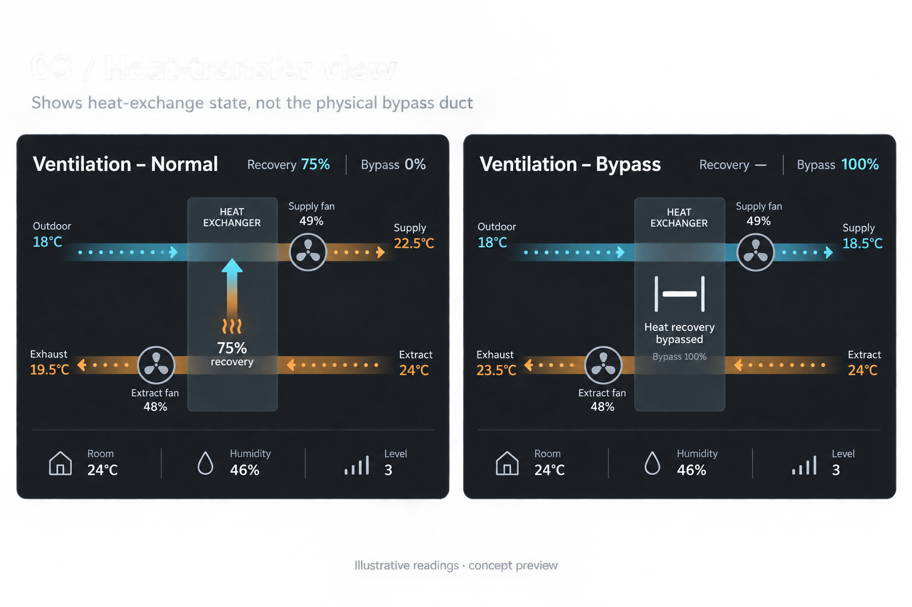

# Airflow Card

[](https://github.com/cybearde/smart-ventilation-card/actions/workflows/ci.yml)
[](https://github.com/cybearde/smart-ventilation-card/actions/workflows/hacs.yml)

A standalone Home Assistant dashboard card for balanced ventilation systems.
It consumes Home Assistant entities and requires neither firmware changes nor
an external JavaScript CDN. It works with ESPHome's native entities, or any
ventilation values that you have already exposed as Home Assistant entities.
It does not connect directly to a controller's HTTP API.



## Install with HACS

Until this repository is included in the default HACS catalog, add it as a
custom repository:

1. Open **HACS → Dashboard**.
2. Open the three-dot menu and choose **Custom repositories**.
3. Add `https://github.com/cybearde/smart-ventilation-card` with category
   **Dashboard**.
4. Select **Airflow Card** in HACS and choose **Download**.
5. Reload Home Assistant and refresh the browser.

HACS normally adds the dashboard resource automatically. If it does not, add
`/hacsfiles/smart-ventilation-card/smart-ventilation-card.js` as a JavaScript
module in **Settings → Dashboards → Resources**.

## Manual install

1. Copy `dist/smart-ventilation-card.js` into
   `/config/www/smart-ventilation-card/smart-ventilation-card.js` on Home Assistant.
2. In **Settings → Dashboards → Resources**, add:
   - URL: `/local/smart-ventilation-card/smart-ventilation-card.js?v=1`
   - Resource type: **JavaScript module**.
   If resources are managed by YAML, add the same URL under
   `lovelace.resources` with `type: module` instead.
3. Reload the dashboard. Choose **Edit dashboard → Add card → By card →
   Airflow Card**. Select entities in the visual editor, or paste YAML.

Increase the resource's `?v=` suffix after replacing the file to avoid caching.
If you created `www` for the first time, restart Home Assistant once.
The distribution file is the complete card; there are no companion assets.

## What the card shows

- Four temperatures, colored on a configurable cyan-to-amber temperature scale.
- Outdoor → supply and extract → exhaust airflow, with direction animation.
- Two fixed, straight airflow lines with a central heat-transfer indicator. Normal
  mode shows recovery; bypass replaces the heat arrow with a muted, crossed-out heat-transfer arrow and the
  actual bypass value. This is a functional diagram, not a physical duct drawing.
- Supply/extract fans integrated beside the exchanger into straight airflow paths, with output
  percentages; optional RPM values remain available in diagnostics.
- A three-part icon footer for room temperature, humidity and ventilation level.
  Recovery and bypass appear in the exchanger; setpoint and hygrostat are in diagnostics.
- Gateway/controller connectivity and any additional entities in a collapsible
  diagnostics section. Add filter register, calibration and clock entities here.
- Heat recovery from an explicit efficiency sensor, or a temperature estimate.

Metric and fan buttons open Home Assistant's standard entity details dialog.
The card itself never calls services or writes to the controller. Air
temperatures are displayed in the diagram. Missing readings show `—`, and
configured unknown/unavailable entities produce a status message.
Animations honor the operating system's reduced-motion preference.

## YAML configuration

All entity assignments are optional; omitted operating metrics are hidden.
Entity IDs are installation-specific: choose them in the visual editor.
The example below uses typical ESPHome IDs; renamed entities must be adjusted.
In the inspected installation, bypass is specifically named
`sensor.hwr_smart_ventilation_bypass_position`.

```yaml
type: custom:smart-ventilation-card
title: Airflow Card
show_title: true
animation: true
show_details: true
show_diagnostics: true
background_opacity: 1
calculate_efficiency: true
temperature_unit: auto
cold_temperature: 0
hot_temperature: 30
bypass_threshold: 1
bypass_active_state: "on"
entities:
  outdoor_temperature: sensor.smart_ventilation_outdoor_air_temperature
  supply_temperature: sensor.smart_ventilation_supply_air_temperature
  extract_temperature: sensor.smart_ventilation_extract_air_temperature
  exhaust_temperature: sensor.smart_ventilation_exhaust_air_temperature
  supply_fan: sensor.smart_ventilation_supply_fan_output
  extract_fan: sensor.smart_ventilation_extract_fan_output
  supply_rpm: sensor.hwr_smart_ventilation_supply_fan_rpm_assumed
  extract_rpm: sensor.hwr_smart_ventilation_extract_fan_rpm_assumed
  bypass: sensor.hwr_smart_ventilation_bypass_position
  room_temperature: sensor.smart_ventilation_room_temperature
  humidity: sensor.smart_ventilation_humidity
  level: select.smart_ventilation_ventilation_level
  setpoint: number.smart_ventilation_temperature_setpoint
  hygrostat: binary_sensor.smart_ventilation_hygrostat
  gateway: binary_sensor.smart_ventilation_gateway_connected
  controller: binary_sensor.smart_ventilation_controller_responding
extra_entities:
  - sensor.smart_ventilation_filter_reset_register
```

`entities.efficiency` optionally overrides the calculated efficiency.
`extra_entities` accepts an ordered list of any HA entity IDs; labels and units
come from Home Assistant. Displayed values can be inspected using more-info.
No filter alarm is inferred from the filter-reset register.

| Option | Default | Meaning |
| --- | --- | --- |
| `title` | `Airflow Card` | Card heading |
| `show_title` | `true` | Show heading; `false` removes the header and keeps a small diagram status |
| `animation` | `true` | Animate airflow/fans when operation is known |
| `background_opacity` | `1` | Background only: `0` transparent, `1` opaque; for example `0.4` for a translucent charcoal surface. Text, fans and values remain fully visible. |
| `show_diagnostics` | `true` | Show diagnostics and additional values; set `false` to hide the entire section |
| `compact` | `false` | Shorter diagram and footer; keeps all readings, moves extract fan labels above the fan |
| `show_details` | `true` | Three-part Room/Humidity/Level footer; `false` gives a shorter card |
| `calculate_efficiency` | `true` | Estimate recovery if no efficiency entity is assigned |
| `temperature_unit` | `auto` | HA temperature preference; explicit `°C` or `°F` also supported |
| `cold_temperature` | `0` | Cold color endpoint, always in °C |
| `hot_temperature` | `30` | Hot color endpoint in °C; must exceed cold endpoint |
| `bypass_threshold` | `1` | Numeric bypass is active at or above this percentage |
| `bypass_active_state` | `on` | Active state for binary/text bypass, case-insensitive |
| `entities` | `{}` | Role-to-entity mapping shown above |
| `extra_entities` | `[]` | Additional diagnostic/service readings |

These options are all editable visually. Home Assistant visibility and grid
options are preserved when switching between editors. Card height follows its
content; it supports masonry and sections dashboards. The heat-transfer design
uses a consistent charcoal palette, cyan/amber airflow and a translucent exchanger
in both light and dark Home Assistant themes.

## Data interpretation

Color limits use Celsius even when displayed readings use Fahrenheit. Celsius,
Fahrenheit and Kelvin input units are normalized before coloring or estimating
recovery. Missing temperature units are treated as Celsius.

Numeric bypass values outside 0–100 are unknown. `on` (or your configured text)
is active; `off`, `closed`, `false` and `inactive` are closed. Other strings are
unknown. The bypass route depicts the configured activation threshold, not a
measured split of airflow for intermediate damper positions. No bypass sensor
means the bypass state is unknown; the card does not invent a closed reading.

Fan output percentages drive animation. If no output entity is configured,
`Level 1`–`Level 4` (or 1–4) provide an animation fallback. A configured missing
output does not use this fallback. Zero output, selected `Off`/0, or a configured
connection sensor not reporting `on` stops the applicable animations.
The firmware's provisional RPM registers can report zero while fans run, so RPM
is displayed without using it to infer operation or an invented maximum speed.

Estimated recovery is `(supply - outdoor) / (extract - outdoor) * 100`.
It is suppressed while bypass is active/unknown, when a required temperature is
missing, for temperature differences under 1 °C, or for results outside 0–100%.
This is a temperature ratio, not measured energy efficiency. A dedicated
efficiency entity displays its own reading instead.

The card follows entity availability from Home Assistant. It does not impose
an age timeout because unchanged HA values can legitimately retain timestamps.
Use the gateway and controller entities to surface bus/device faults. ESPHome's
sensor expiry remains responsible for marking stale individual readings.

## Development and testing

Node.js 20.19+ (tested with 22.23.1). Runtime has zero npm dependencies; jsdom is
a test-only dependency.

```sh
cd home-assistant-card
npm ci
npm test
npm run build
```

Tests cover temperature conversion, bounds, bypass detection, fan semantics,
recovery edge cases, DOM rendering, escaping, unavailable states, event
propagation, update filtering and editor round-trips.

The provided shared `../../ha_testing` instance is supported directly:

```sh
python3 tests/make-fixtures.py
npm run build
python3 tests/deploy.py
```

Deployment requires write access to the shared test configuration and Docker.
It backs up the original `configuration.yaml` once, installs an isolated helper
package and YAML dashboard, adds a resource with a content hash, validates HA
configuration, and restarts **ha-testing**. It preserves the Modern Room Card
resource and dashboard. Synthetic helpers have the `sv_test_` prefix.
Do not point this helper at production.

Open [Smart Ventilation Test](http://localhost:8123/smart-ventilation-test/ventilation).
It contains full, compact/Fahrenheit, missing-sensor and unconfigured examples,
plus synthetic controls. The existing **Test matrix** also contains a saved
`Ventilation · visual editor test` card for editing through HA's UI. The
separate YAML dashboard intentionally remains a reproducible test fixture.

See [test record](tests/VERIFICATION.md) for the checks performed in HA.

### Custom display names and center description

The visual editor includes **Heat exchanger label**, **Show center recovery/bypass
description**, and an expandable **Custom display names** section. Names affect
only presentation; entity assignments stay unchanged. Empty custom names restore
the defaults. An empty exchanger label hides the heading.

```yaml
exchanger_label: Ventilation unit
show_status_text: true
labels:
  outdoor_temperature: Outside
  supply_temperature: Fresh air
  extract_temperature: Return air
  exhaust_temperature: Exhaust
  supply_fan: Intake fan
  extract_fan: Extract fan
  room_temperature: Room
  humidity: Humidity
  level: Speed
  recovery: Recovery
  bypass: Bypass
```

`labels` accepts every entity role listed above, plus `recovery`. The center has
one description, e.g. “Recovery 84%” or “Bypass 100%”; binary bypass states show
“Bypass active”. Set `show_status_text: false` to hide this description while
keeping the recovery/bypass graphic. Offline and unknown states retain the card's
connection/unavailable notices.

Enable **Compact layout** in the visual editor or set `compact: true` in YAML.
Title, diagnostics, custom names and transparency continue to work independently.

### Target temperature in compact mode

With `compact: true`, a configured `entities.setpoint` appears as **Target** in the
footer, alongside Room, Humidity and Level. It works with diagnostics hidden.
The visual editor toggle **Show target temperature in compact footer** maps to
`show_target_temperature` (default `true`). Set it to `false` for the three-value
footer. On narrow cards, a four-value footer omits icons to keep one readable row.
The target supports temperature conversion, custom `labels.setpoint`, and more-info.

Fans use a transparent open ring with three outlined blades. Bypass displays a
static, muted heat-transfer arrow with a diagonal slash; normal recovery keeps
the animated cyan/amber arrow. Both symbols support compact mode.
