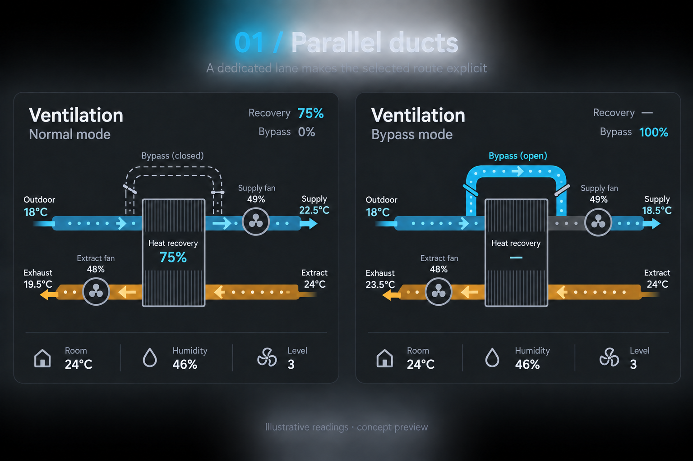
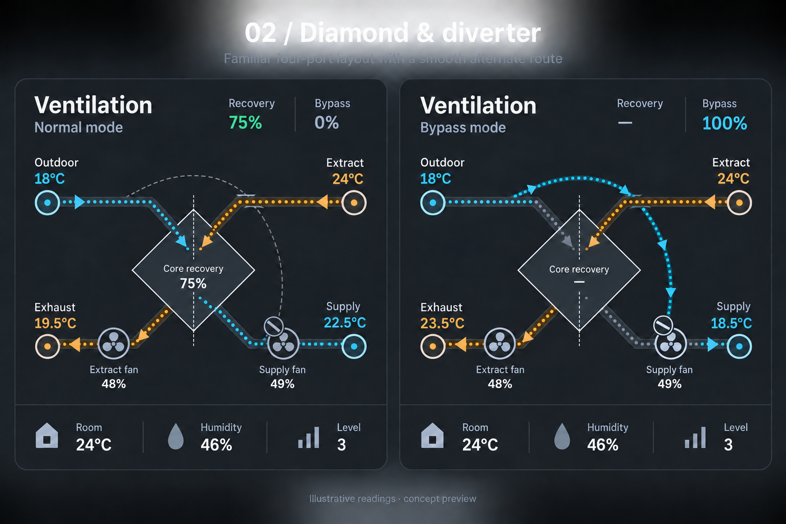

# Ventilation mode concepts

Three original concept sheets, each showing normal operation on the left and
full bypass on the right. Generated with the built-in image_gen tool; exact
prompts and refinements are in PROMPTS.md. Values are synthetic illustrative
readings. These are visual design proposals, not screenshots of implemented
cards or diagrams of the actual device's internal construction.

## 1. Parallel ducts — recommended

Put Outdoor → Supply on the upper rail and Extract → Exhaust on the lower
rail. The streams never cross. Show a dedicated bypass branch above the core
in both modes, dimmed when unused. In bypass mode dim only the through-core
supply branch; inlet, bypass, merge-to-fan and outlet remain active. Extraction
continues through its own channel. Endpoints and fan positions never move.

Implementation: three fixed SVG route groups, fixed gradient coordinates,
opacity/CSS animation changes and a small rotating damper marker. No path
morphing or layout changes. Low complexity. This changes the terminal arrangement
from the current four-corner design but gives the clearest route selection.

## 2. Diamond & diverter

Retain the existing four-corner labels, use a diamond-shaped core, and provide
one smooth bypass curve around its upper and right perimeter. Both routes stay
visible, with the unused supply route dimmed. The bypass rejoins before the
supply fan. Supply arrows run outdoor-to-supply; extraction arrows run
extract-to-exhaust. A crossing bridge distinguishes the bypass from extraction.

Implementation: a diamond polygon, two diagonal paths, a cubic Bezier bypass,
a small crossing mask, and a rotating damper. Fixed SVG geometry; animate the
selected route with dash offset. Medium complexity; needs more space and mobile
crossing/label checks than option 1. Closest to the current endpoint arrangement.

## 3. Heat-transfer view

Use two straight, fixed airflow rails. During normal operation, an animated
heat-transfer symbol between them shows recovery. During bypass, replace that
symbol with an open-damper indicator and 'Heat recovery bypassed'. This is an
abstract functional view: it communicates heat-exchange state rather than
showing the physical alternate duct. Heat arrows represent energy, not airflow.

Implementation: two lines, one central translucent band, a state-dependent
icon, numeric text and CSS animation. Lowest complexity and most compact.
Retains temperature colors without requiring any duct to change geometry.

## Shared implementation rules

- Retain the existing entity mappings and YAML/visual-editor behavior.
- Respect title visibility, reduced motion, zero output, and connectivity.
- Show unavailable/unknown states without claiming a known damper position.
- Numeric bypass percentage describes damper position, not measured airflow
  split; do not convert partial opening into a claimed flow percentage.
- Color segments from actual temperatures; keep coordinates fixed so changing
  SVG bounding boxes cannot change gradient placement between modes.
- Keep core recovery text unboxed; suppress estimated recovery in bypass.
- Render fans as vector components and preserve more-info interactions.
- Generated samples illustrate appearance. Final SVG routing, arrow directions,
  active branch continuity, theme contrast and mobile spacing require exact
  implementation and testing; the raster images are not runtime assets.

## Inspiration

[Frickeldave/homeassistant-airflow](https://github.com/Frickeldave/homeassistant-airflow)
contributes the four-stream terminology, animated flow and an explicitly
rerouted fresh-air branch.
[Symphy24/homeassistant-ventilation-card](https://github.com/Symphy24/homeassistant-ventilation-card)
contributes the engineering AHU schematic approach, component symbols and
compact operating values. These concepts are original alternatives built
around those ideas; no source code was copied.

The working card and Home Assistant test dashboard were not modified by this
concept exploration.
